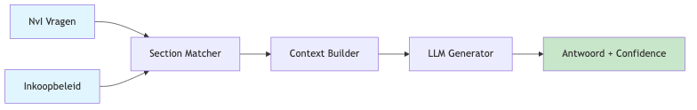
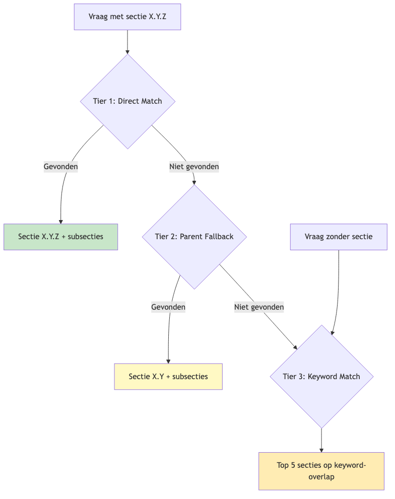
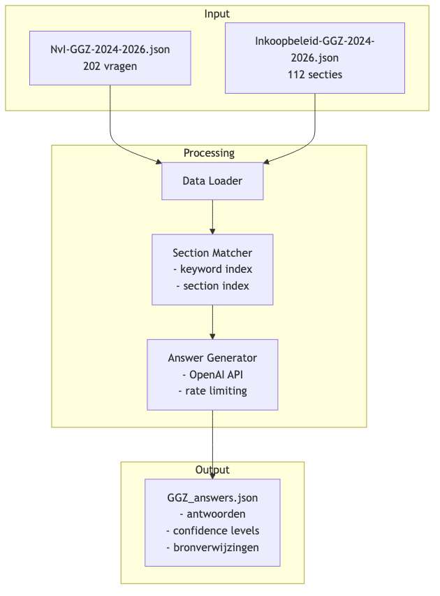
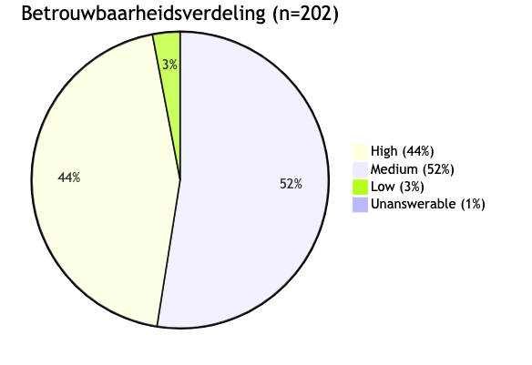

# 1. Inleiding

## Het probleem

Bij de zorginkoop voor de Wet langdurige zorg (Wlz) publiceert Zilveren Kruis jaarlijks een inkoopbeleid. Zorgaanbieders kunnen hierover vragen stellen via de **Nota van Inlichtingen (NvI)**. Voor de GGZ-sector betekent dit het beantwoorden van meer dan 200 vragen per inkoopperiode.

Het handmatig beantwoorden van deze vragen is tijdrovend:

- Elke vraag moet worden gekoppeld aan de relevante beleidssectie
- Het antwoord moet consistent zijn met het gepubliceerde beleid
- De formulering moet zorgvuldig en professioneel zijn

## De oplossing

Dit project automatiseert het beantwoordingsproces door:

1. Vragen automatisch te matchen aan relevante beleidssecties
2. Antwoorden te genereren met behulp van een Large Language Model (LLM)
3. Een betrouwbaarheidsniveau toe te kennen aan elk antwoord

Dit maakt het mogelijk om snel concept-antwoorden te genereren die vervolgens door experts kunnen worden geverifieerd.

\newpage

# 2. Databronnen

## 2.1 Het Inkoopbeleid

Het **inkoopbeleid** is het basisdocument waarin Zilveren Kruis beschrijft hoe zij zorg inkoopt voor de Wlz. Dit document bevat:

- **Inkoopdoelen**: de strategische prioriteiten voor de inkoopperiode
- **Tariefafspraken**: percentages en opslagen per zorgprofiel
- **Procedures**: tijdlijnen, inschrijvingsvoorwaarden, bezwaarprocedures
- **Kwaliteitseisen**: verwachtingen richting zorgaanbieders

Voor de GGZ Wlz 2024-2026 bevat het inkoopbeleid **112 secties**, gestructureerd in hoofdstukken:

| Hoofdstuk | Onderwerp |
|-----------|-----------|
| 1 | Inkoopdoelen en focus |
| 2 | Tarieven en financiering |
| 3 | Regionale samenwerking |
| 4 | Kwaliteit en toezicht |
| 5 | Productieafspraken |
| 6 | Procedures en termijnen |
| 7 | Overige bepalingen |

## 2.2 De Nota van Inlichtingen (NvI)

De **Nota van Inlichtingen** is het vraag-en-antwoord document waarin zorgaanbieders verduidelijking kunnen vragen over het inkoopbeleid. Kenmerken:

- Vragen worden ingediend per beleidssectie (bijv. "1.2", "2.3.1")
- Sommige vragen hebben geen sectieverwijzing (algemene vragen)
- Antwoorden worden gepubliceerd zodat alle zorgaanbieders dezelfde informatie hebben

**Dataset GGZ 2024-2026:**

- **202 vragen** van zorgaanbieders
- Inclusief originele handmatige antwoorden (voor vergelijking)

## 2.3 Dataformaat

De documenten zijn geparseerd naar JSON-formaat:

**Inkoopbeleid (voorbeeld):**

```json
{
  "section": "1.2",
  "title": "Inkoopdoel 1: Het organiseren van passende zorg...",
  "text": "De zorg voor mensen met een complexe zorgvraag..."
}
```

**NvI-vraag (voorbeeld):**

```json
{
  "section": "1.2",
  "question": "Hoe kan je in aanmerking komen voor Z1007 en Z1008?",
  "answer": "U kunt met uw zorginkoper afspreken welke zorg..."
}
```

\newpage

# 3. Pipeline-architectuur

## 3.1 Overzicht

De pipeline verwerkt vragen in vier stappen:

{width=90%}

## 3.2 Componenten

### Data Loader

Laadt de JSON-bestanden en parseert ze naar Python-objecten:

- `NvIQuestion`: vraag met sectieverwijzing
- `InkoopbeleidSection`: beleidssectie met titel en tekst

### Section Matcher

Vindt relevante beleidssecties voor elke vraag via een **multi-tier strategie**:

{width=85%}

**Tier 1 - Direct Match:**

- Zoek exacte sectie (bijv. "1.2")
- Voeg alle subsecties toe (bijv. "1.2.1", "1.2.2")

**Tier 2 - Parent Fallback:**

- Als "1.4.5" niet bestaat, probeer "1.4"
- Nuttig bij foutieve sectieverwijzingen

**Tier 3 - Keyword Match:**

- Extraheer keywords uit de vraag
- Zoek secties met hoogste keyword-overlap
- Retourneer top 5 matches

### Context Builder

Formatteert gematchte secties tot leesbare context voor het LLM:

```
[Sectie 1.2] Inkoopdoel 1: Het organiseren van passende zorg...
De zorg voor mensen met een complexe zorgvraag staat al...

[Sectie 1.2.1] We zetten actief in op de bemiddeling...
In de regel organiseren zorgaanbieders in samenspraak...
```

### Answer Generator

Genereert antwoorden via de OpenAI API met:

- **Structured outputs**: gegarandeerd JSON-formaat
- **Rate limiting**: token bucket voor API-limieten
- **Async processing**: parallelle verwerking van vragen

**Systeemprompt (samengevat):**

> Je bent expert op het gebied van het zorginkoopbeleid van Zilveren Kruis voor de Wlz. Beantwoord vragen op basis van de verstrekte beleidstekst. Geef een betrouwbaarheidsniveau: high, medium, low, of unanswerable.

## 3.3 Dataflow

{width=95%}

\newpage

# 4. Resultaten

## 4.1 Statistieken GGZ-run

De volledige run op de GGZ NvI 2024-2026 leverde de volgende resultaten:

| Metric | Waarde |
|--------|--------|
| Totaal aantal vragen | 202 |
| Inkoopbeleid secties | 112 |

**Betrouwbaarheidsverdeling:**

| Confidence | Aantal | Percentage |
|------------|--------|------------|
| High | 89 | 44% |
| Medium | 105 | 52% |
| Low | 6 | 3% |
| Unanswerable | 2 | 1% |

{width=60%}

## 4.2 Interpretatie van confidence levels

**High (44%):**

- De vraag kan volledig worden beantwoord met de beschikbare beleidstekst
- Direct bruikbaar met minimale review

**Medium (52%):**

- Relevante informatie beschikbaar, maar belangrijke details ontbreken
- Vaak betreft dit:
  - Vragen over specifieke procedures die niet volledig zijn uitgeschreven
  - Vragen die verwijzen naar bijlagen of externe documenten
  - Vragen over uitzonderingen die niet expliciet in het beleid staan

**Low (3%):**

- Alleen zijdelings gerelateerde informatie gevonden
- Vereist handmatige beantwoording of aanvulling

**Unanswerable (1%):**

- Geen relevante informatie in het inkoopbeleid
- Betreft vaak vragen over interne processen of historische beslissingen

## 4.3 Analyse: waarom medium-antwoorden afwijken

De medium-categorie (52%) verschilt vaak van de originele handmatige antwoorden. Oorzaken:

1. **Interne kennis**: Handmatige antwoorden bevatten soms informatie die niet in het gepubliceerde beleid staat (bijv. verwijzingen naar bijlage 7, interne werkprocessen)

2. **Interpretatie**: Beleidsmedewerkers kunnen context toevoegen op basis van ervaring met eerdere vragen

3. **Actualiteit**: Sommige antwoorden verwijzen naar ontwikkelingen na publicatie van het beleid

**Voorbeeld:**

*Vraag:* "Hoe is de tariefafslag tot stand gekomen?"

*Origineel antwoord:* "De tariefpercentages zijn bepaald volgens de methodiek in bijlage 7."

*Gegenereerd antwoord:* "De tekst vermeldt dat er een afslag wordt toegepast, maar de exacte methodiek wordt niet beschreven in het beleid."

Het gegenereerde antwoord is correct op basis van de gepubliceerde tekst; het originele antwoord verwijst naar een bijlage die niet in de dataset zit.

\newpage

# 5. Conclusies

## Bruikbaarheid

**96% van de gegenereerde antwoorden is bruikbaar** (high + medium):

- 44% direct inzetbaar met minimale review
- 52% bruikbaar als startpunt met aanvulling door experts

## Beperkingen

Het systeem kan alleen antwoorden genereren op basis van:

- Het gepubliceerde inkoopbeleid
- De secties die in de dataset zijn opgenomen

Het systeem kan **niet** antwoorden op vragen over:

- Interne processen en werkwijzen
- Historische beslissingen en overwegingen
- Informatie uit bijlagen die niet zijn geparseerd
- Ontwikkelingen na publicatie van het beleid

## Aanbevelingen

1. **Uitbreiding dataset**: Voeg bijlagen en aanvullende documenten toe aan de kennisbank

2. **Iteratieve verbetering**: Gebruik feedback van experts om de matching-strategie te verfijnen

3. **Human-in-the-loop**: Implementeer een review-workflow waarbij experts gegenereerde antwoorden valideren en aanvullen

4. **Uitbreiding naar andere domeinen**: De pipeline is generiek en kan worden toegepast op GZ (Gehandicaptenzorg) en VV (Verpleging & Verzorging)

\newpage

# Bijlage: Technische details

## Gebruikte technologieën

| Component | Technologie |
|-----------|-------------|
| Taal | Python 3.13 |
| LLM API | OpenAI GPT-4.1 |
| Data validatie | Pydantic |
| Async processing | asyncio |
| Structured outputs | OpenAI beta API |

## Projectstructuur

```
nvi-beantwoording/
+-- src/
|   +-- config.py          # Configuratie en settings
|   +-- data_loader.py     # JSON parsing
|   +-- models.py          # Pydantic modellen
|   +-- section_matcher.py # Multi-tier matching
|   +-- answer_generator.py# LLM integratie
|   +-- pipeline.py        # Orchestratie
+-- parsed_data/
|   +-- Inkoopbeleid-GGZ-2024-2026.json
|   +-- NvI-GGZ-2024-2026.json
|   +-- ggz_automatic_question_answer.jsonl
+-- output/
    +-- GGZ_answers.json
```

## Uitvoering

```bash
# Activeer virtual environment
source .venv/bin/activate

# Run pipeline voor GGZ domein
python -m src.pipeline GGZ

# Run met limiet (voor testing)
python -m src.pipeline GGZ 10
```
